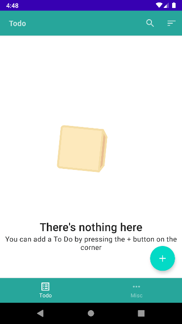
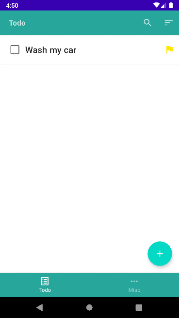

# Cata

A to do apps

## Screenshots

Add to do

Edit to do

Theming using DataStore and preference

TODO

## Features

- Add to do with priority, image attachment, and priority
- Sorting and filter
- Search
- Delete to do
- Dark & light theme

## What I use in and learned from this project

- [Jetpack Compose](https://developer.android.com/jetpack/compose) & animations
- Jetpack navigation
- Single activity architecture
- [DataStore](https://developer.android.com/topic/libraries/architecture/datastore)
- Flow
- Splash screen
- MVVM architecture with use cases
- Room database
- Lottie for image animation
- Dagger2 & Hilt
- Material composables

# License

Licensed under [MIT License](LICENSE)
